# 智慧党建平台

## 📞 联系方式
**✈ 如需更多源码和二次开发，以及定制交付服务可联系我们**
**🚀 QQ交流：25463204**

---

## 项目简介

智慧党建平台是一个基于移动互联网的党建管理系统，旨在高效解决党员党务工作、党员学习、宣传工作、活动策划、民生问题等方面的工作问题。本项目基于Java的SpringBoot若依(RuoYi)框架进行二次开发，采用前后端分离架构。

## 技术栈

### 后端技术栈

| 技术 | 版本 | 说明 |
|------|------|------|
| Spring Boot | 2.5.15 | Web应用框架 |
| Apache Shiro | 1.13.0 | 安全框架 |
| MyBatis | - | 持久层框架 |
| PageHelper | 1.4.7 | 分页插件 |
| Druid | 1.2.23 | 数据库连接池 |
| MySQL | - | 数据库 |
| Thymeleaf | - | 模板引擎 |
| Swagger | 3.0.0 | API文档 |
| Quartz | - | 定时任务 |
| EhCache | - | 缓存框架 |
| FastJSON | 1.2.83 | JSON处理 |
| POI | 4.1.2 | Office文档处理 |

### 前端技术栈

| 技术 | 说明 |
|------|------|
| uni-app | 跨平台应用框架 |
| Vue.js | 前端框架 |
| Element UI | UI组件库 |
| HBuilderX | 开发工具 |

## 项目结构

```
dangjian/
├── admin/                    # 后台管理Web服务入口
├── common/                   # 公共模块（工具类、常量、异常处理）
├── framework/                # 框架核心模块（Shiro配置、数据源配置）
├── system/                   # 系统模块（用户、角色、菜单、部门等）
├── biz-core/                 # 党建业务核心模块
├── app/                      # APP移动端接口模块
├── portal/                   # 门户接口模块
├── quartz/                   # 定时任务模块
├── generator/                # 代码生成模块
└── dangjian-ui-web-portal/  # 前端门户项目
```

## 功能模块

### 核心业务功能

| 序号 | 模块 | 功能描述 |
|------|------|----------|
| 1 | 轮播图管理 | 灵活展示党建重要信息、活动预告、学习资料等 |
| 2 | 通知公告 | 支持富文本编辑、有效期设置、公告提醒 |
| 3 | 党建资讯 | 资讯发布、审核、评论功能 |
| 4 | 党组活动 | 会议记录、学习计划、心得体会、美文分享、小组故事、问题墙 |
| 5 | 荣誉奖项 | 荣誉发布、展示、统计功能 |
| 6 | 违规违纪 | 违规记录、公示、统计功能 |
| 7 | 党组织管理 | 党组织架构、党员信息、角色管理 |
| 8 | 选举管理 | 党代表选举、换届选举、在线投票、计票 |
| 9 | 在线学习 | 学习分类、审批、收藏、学习记录 |
| 10 | 学分管理 | 成员学分、小组学分、学分规则与统计 |
| 11 | 题库管理 | 题库分类、批量导入、题目管理 |
| 12 | 考试管理 | 考试创建、发布、成绩统计 |
| 13 | 发展党员 | 全流程管理、五阶段流转、资料上传审核 |

### 详细业务功能清单

#### 内容管理
- **轮播图管理** - 图片上传、编辑、删除、顺序设置
- **图片管理** - 党建相关图片资源管理
- **资讯管理** - 党建资讯的发布、审核、展示
- **学习资讯** - 学习资料类资讯管理

#### 党组织活动
- **会议记录** - 党组织会议内容记录
- **学习计划** - 党组织学习计划制定
- **心得体会** - 党员学习心得分享
- **小组故事** - 党组织活动故事记录
- **问题墙** - 党员问题建议反馈
- **心得分享** - 党员心得交流
- **工作交流** - 工作经验交流分享
- **工作分配** - 任务分配与跟踪

#### 先进典型
- **先进事迹** - 党员先进事迹宣传
- **学习心得** - 学习成果展示
- **亮点工作** - 工作亮点展示
- **美文分享** - 优秀文章分享
- **文章管理** - 文章发布与管理

#### 监督管理
- **组织生活** - 党组织生活记录
- **民生接待** - 群众来访接待记录

#### 考核评价
- **在线学习** - 党员在线学习
- **在线考试** - 理论水平测试
- **答题管理** - 题目与试卷管理
- **我的答题** - 答题记录查看
- **学习收藏** - 课程收藏功能

#### 发展党员
- **发展党员流程** - 申请入党→积极分子→发展考察→预备党员→转正
- **资料审核** - 各阶段资料上传与审批

#### 选举投票
- **党代表选举** - 党代表选举管理
- **换届选举** - 换届选举管理
- **被选举人管理** - 候选人管理
- **投票记录** - 投票结果记录

## 快速开始

### 环境要求

- JDK 1.8+
- Maven 3.6+
- MySQL 5.7+
- Node.js (前端开发)

### 后端部署

```bash
# 1. 导入数据库
mysql -u root -p < database.sql

# 2. 修改配置文件
# 编辑 admin/src/main/resources/application.yml
# 配置数据库连接信息

# 3. 打包项目
mvn clean package -DskipTests

# 4. 启动项目
java -jar admin/target/smart-party-building-admin.jar
```

### 前端部署

```bash
# 进入前端目录
cd smart-party-building-ui-web-portal

# 安装依赖
npm install

# 开发模式
npm run dev

# 生产打包
npm run build
```

### 默认账户

- 管理员：admin/admin123

## API文档

启动项目后访问：`http://localhost:8080/swagger-ui.html`

## 项目截图


## 目录结构说明

### 后端目录结构

```
biz-core/src/main/java/com/ruoyi/party/building/
├── award/              # 荣誉管理
├── article/            # 文章管理
├── collect/            # 学习收藏
├── deed/               # 先进事迹
├── develop/            # 发展党员
├── exchange/           # 工作交流
├── feel/               # 心得分享
├── flow/               # 任务流程
├── inspect/            # 民生接待
├── learn/              # 在线学习
├── light/              # 亮点工作
├── news/               # 资讯管理
├── picture/            # 图片管理
├── plan/               # 学习计划
├── problem/            # 问题墙
├── question/            # 题库管理
├── questiontype/       # 题目类型
├── questionpager/      # 题目试卷关联
├── pager/              # 试卷管理
├── pageruser/          # 考试对象
├── record/             # 会议记录
├── story/              # 小组故事
├── tale/               # 美文分享
├── upload/             # 文件上传
├── violate/            # 违规违纪
├── vote/               # 选举投票
├── work/               # 任务工作
├── workdist/           # 任务分配
└── detail/             # 党员详情
```

### 前端目录结构

```
dangjian-ui-web-portal/
├── pages/              # 页面目录
│   ├── index/          # 首页
│   ├── details/        # 详情页
│   ├── list/           # 列表页
│   ├── login/          # 登录页
│   ├── kaoshi/         # 考试相关
│   ├── xuanju/         # 选举相关
│   ├── develop/        # 发展党员
│   ├── xuexi/          # 学习相关
│   └── locked/         # 锁定页
├── components/         # 组件目录
├── static/             # 静态资源
├── common/              # 公共工具和API
└── images/             # 图片资源
```

## 项目截图

### PC端截图

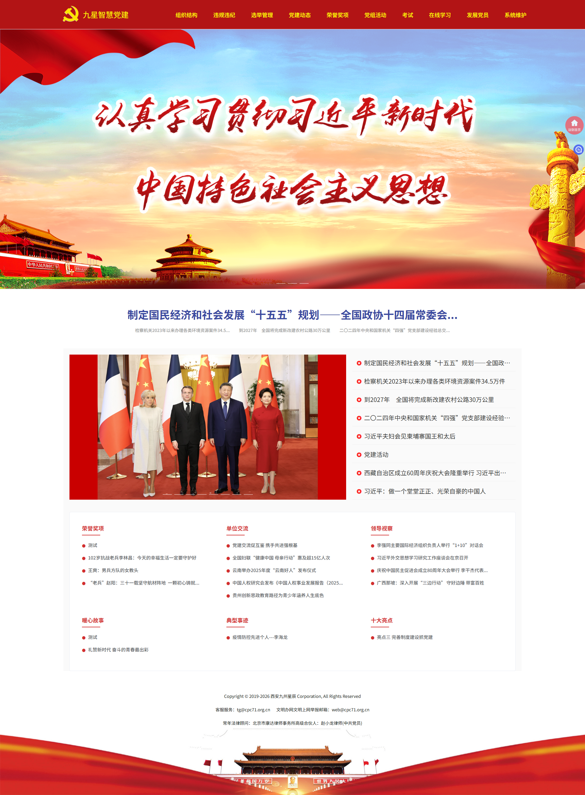
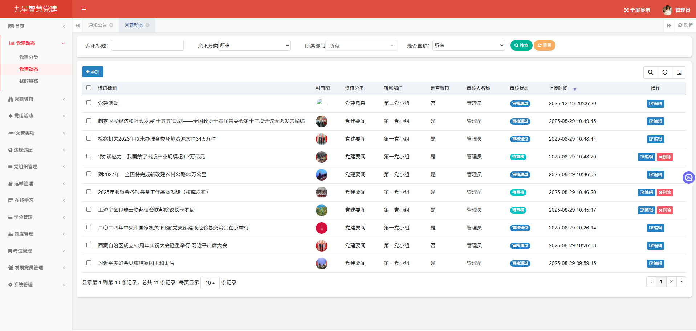
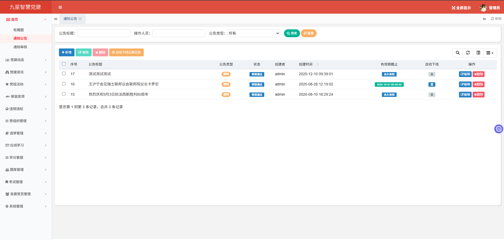
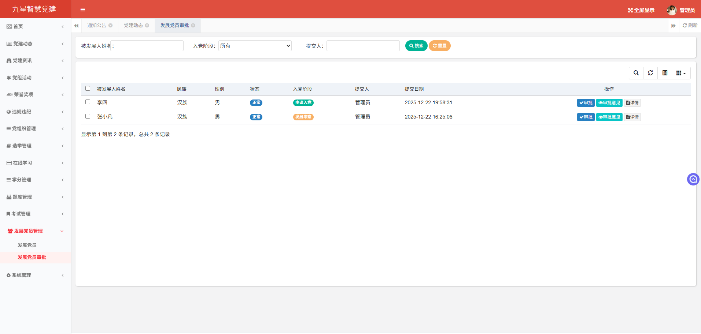
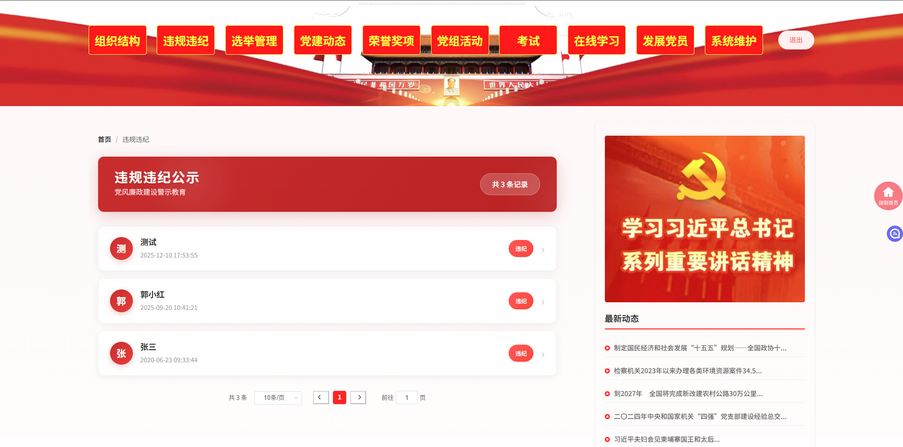

### H5移动端截图

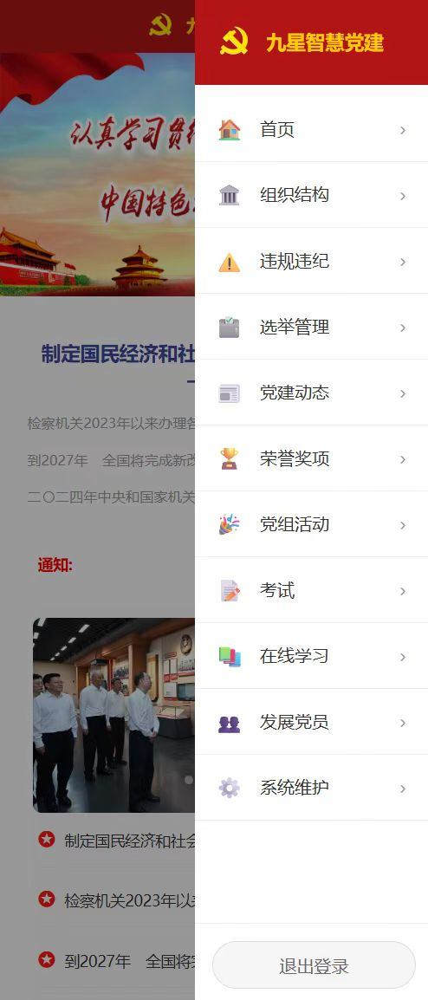
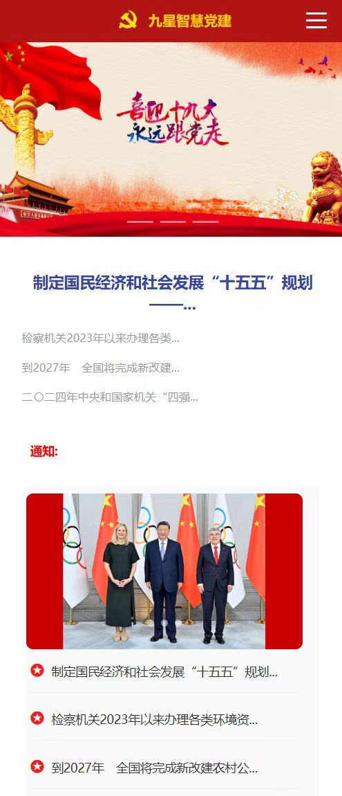
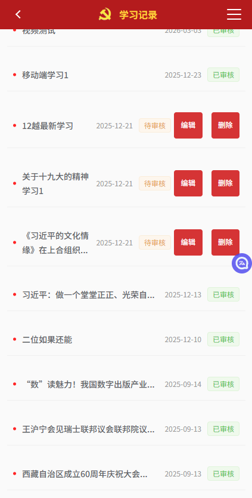
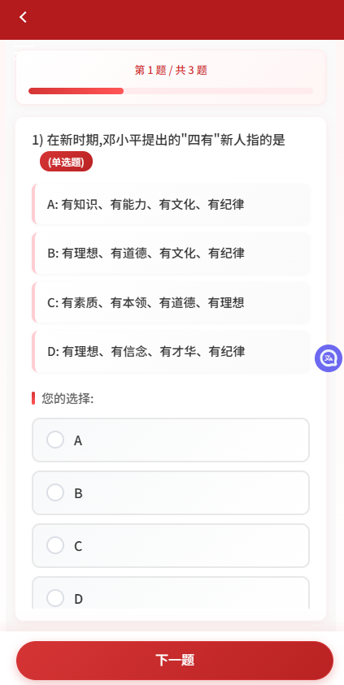
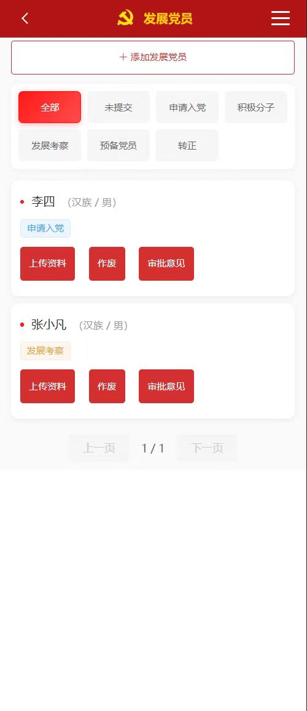
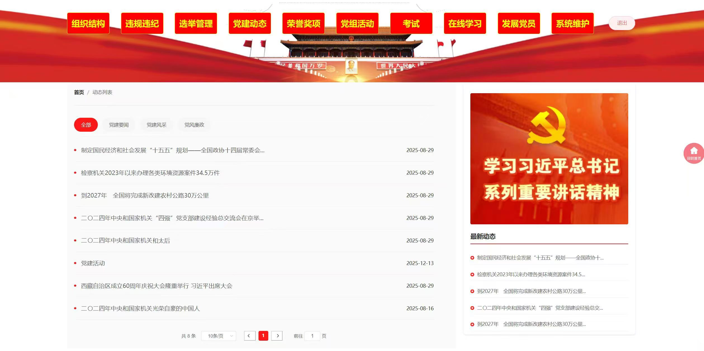
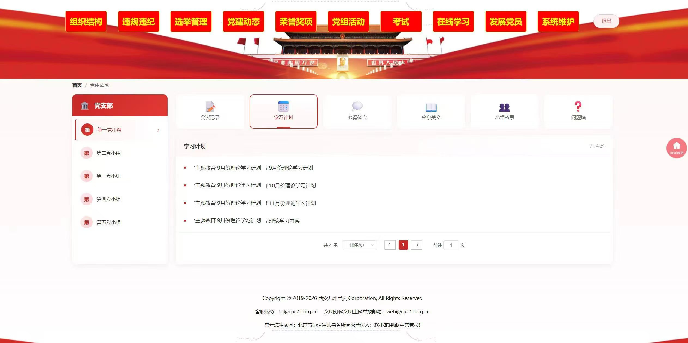

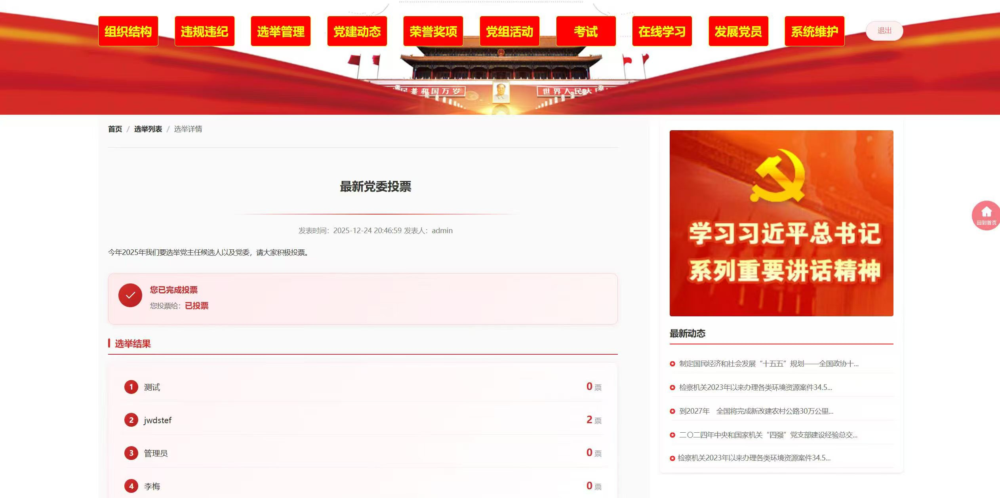
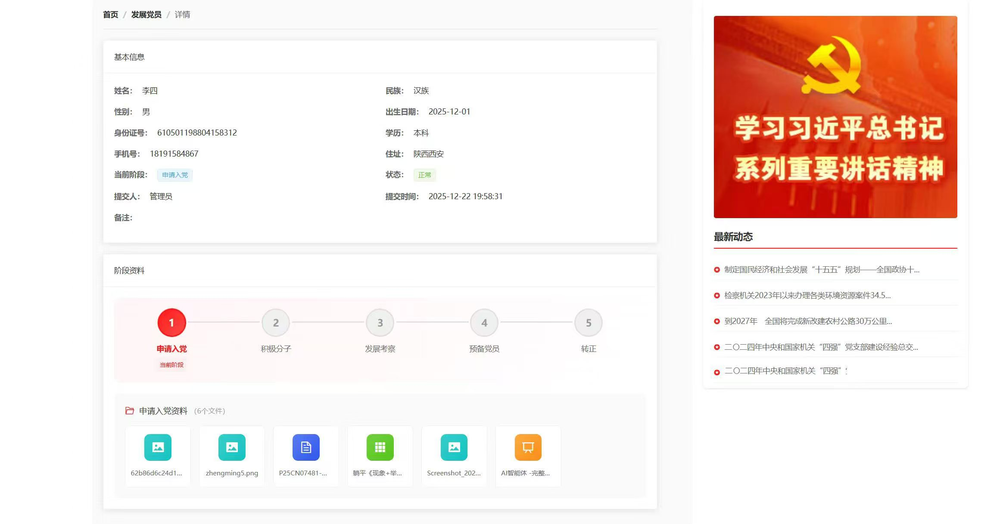


